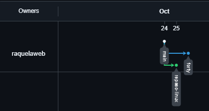

Raquel Vales Vilas

Descripción:

En este repositorio se encuentran ejercicios de repaso de Linux y los ejercicios Forty realizados en clase.

URL del repositorio remoto:

https://github.com/raquelaweb/TareaRepositorios

Captura de pantalla de Insights-Network:

